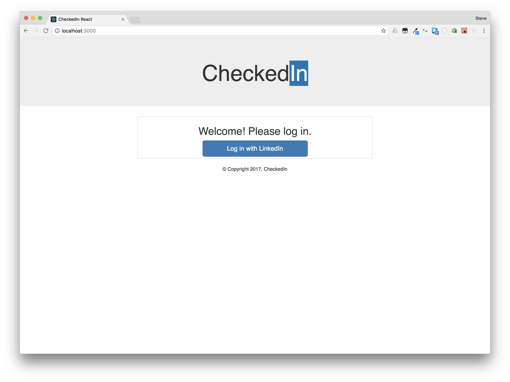

# CheckedIn_React
Final Project for UNC Coding School

## Team Members:
* **Jon Riddick** - GitHub: [Jon Riddick](https://github.com/jonriddick)
* **Zeynep Dayar** - GitHub: [Zeynep Dayar](https://github.com/zdayar)
* **Kristin Glaze** - GitHub: [Kristin Glaze](https://github.com/kiglaze)
* **Steve Murphy** - GitHub: [Steve Murphy](https://github.com/stevemurphy256)

## Project Description

CheckedIn_React is a full-stack MERN app developed to assist event Organizers and Hosts with the task of networking with their event Attendees. The app uses the Passport Linkedin OAuth 2.0 library to retrieve user profile information for both the Host as well as the Attendees and populate a Mongo Database. Once the event is complete the Host can easily retrieve the Linkedin contact information for any or all of their Attendees and connect with them on Linkedin.

## Getting Started on your local machine

- Clone this repo to your computer.
- Make sure you have Mongo Database running before attempting to start the app.
- Navigate to the project folder and run `yarn install`.
- Change directory into the `client` folder and run `yarn install` again.
- Change back into the project folder and run `yarn start`.
- The app should open in the browser.
- You can open your browser and navigate to localhost:3000, alternatively.

## Technologies used
- MongoDB
- Express
- ReactJS
- Node
- Axios
- Express Session

## Demo Screenshots

## WEBSITE LINK

### Prerequisites

Run yarn install in both the main (checkedin) folder and in the client folder, then yarn start in the main folder. 
Also when you run this, please make sure you have mongo running locally (mongod and mongo).

A user has to sign up using an email address and a password before they can use the app. Once signed up, the user can log in to the app. On the main page, the rooms in the user's house are displayed along with the items in each room. The user can add new rooms, and can also add items to each room. Items can also be removed. Finally, the user can search for items in their house.  

- Express is used to handle routing. 
- Handlebars is used for rendering the UI pages.
- MySQL is used for storing persistent data.  
- Sequelize is used as the ORM interface to MySQL
- Passport is used for authentication (new technology).
- Bootstrap is used for styling.  
- The app runs on port 3000 locally.

